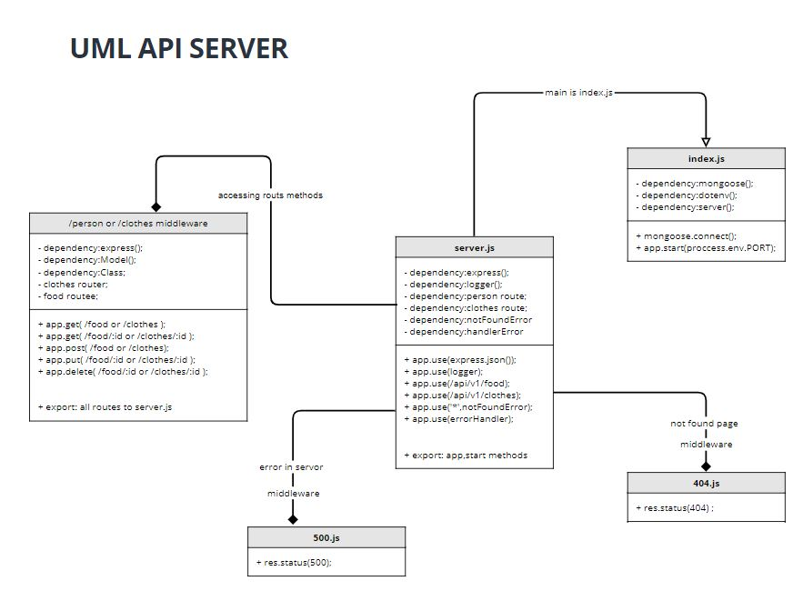

# api-server

## LAB - 04

## **Deployment Test**
## **Author: Farah AlWahaibi**

[PR LINK](https://github.com/farahalwahaibi/api-server-/pull/1)

[Heroku APP](https://api-server-2021.herokuapp.com/)

[Report Test](https://github.com/farahalwahaibi/api-server-/actions)

## **Setup**
* .env requirements
  * **PORT** - 3000
  * **MONGOOSE_URI**

## **Running the app**
* **npm start**
* **Endpoints:**
   * **/person** or **/clothes** will return a json list of all current data 
   * **/person/:id** or **/clothes/:id** will return specific data for specific id
   * **POST** requests to **/person** or **/clothes** will create new data 
   * **PUT** requests to **/person/:id** or **/clothes/:id** will update current data depends on it's provided id
   * **DELETE** requests to **/person/:id** or **/clothes/:id** will delete specific data depends on it's provided id

## **Tests**
* **404** on a bad route
* **404** on a bad method
* The correct status codes and returned data for each REST route
  * Create a record using POST
  * Read a list of records using GET
  * Read a record using GET
  * Update a record using PUT
  * Destroy a record using DELETE

***

## **UML Diagram**

***Thank you!!***
